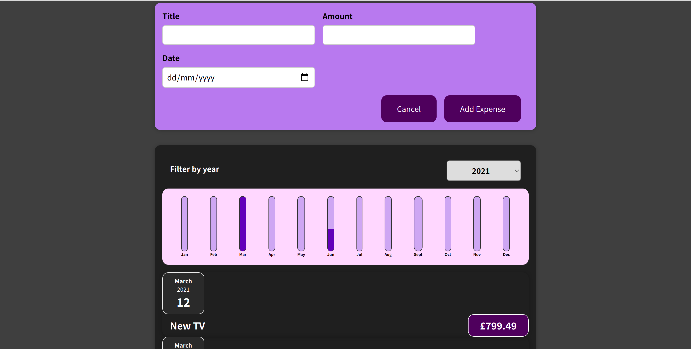

# Expenses Tracker

> This app helps you keep track of your expenses in months and years. Also, it shows a graph representing those expenses.

## Built With

- Major languages: JavaScript, HTML & CSS;
- Frameworks: React;
- Technologies used: GitHub, GitFlow, Terminal;

## Live Demo

[Live Demo Link](https://expenses-tracker-with-react.netlify.app/)

## Getting Started

### Prerequisites

- Please make sure you have Node.js packedge installed on your terminal.

### Setup

To get a local copy up and running follow these simple steps.

To setup the bookstore project in your local, in the repo page:
click on code (dropdown list) > Download as ZIP;
or open terminal of path you want to install project and run this command  
`git clone git@github.com:nicupop729/expense-tracker.git`.

### Install

Run in your terminal the following commands:

**`$ cd expenses-tracker/`** 
**`$ npm install`** 
**`$ npm start`**

## Author

👤 **Nicolae Pop**

- GitHub: [@nicupop729](https://github.com/nicupop729)
- Twitter: [@nicupop729](https://twitter.com/nicupop729)
- LinkedIn: [LinkedIn](https://www.linkedin.com/in/nicolae-pop/)

## 🤝 Contributing

Contributions, issues, and feature requests are welcome!

Feel free to check the [issues page](https://github.com/nicupop729/expense-tracker/issues).

## Show your support

Give a ⭐️ if you like this project!

## 📝 License

This project is [MIT](./MIT.md) licensed.
